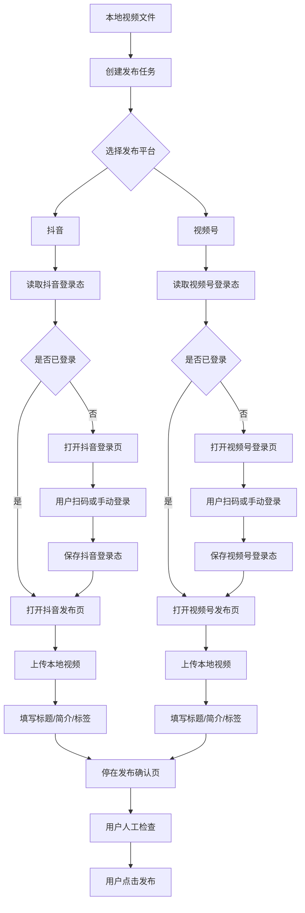

# PRD：AI 视频自动发布工具

## 1. 项目目标

开发一个本地 AI 视频自动发布工具，实现从本地视频素材到抖音、视频号的自动上传流程。

工具第一版只支持两个平台：

```text
抖音
视频号
```

核心目标：

```text
用户准备好视频文件、标题、简介、标签后，
系统自动打开平台后台，
复用账号登录状态，
上传本地视频，
填写发布信息，
最后停在发布确认页，
由用户人工确认是否发布。
```

第一版不做：

```text
不自动生成视频
不保存账号密码
不绕过验证码
不绕过扫码登录
不默认点击最终发布
不做小红书、B站、快手等其他平台
```

## 2. 参考项目拆解

参考项目：

```text
https://github.com/dreammis/social-auto-upload
```

参考方式：

```text
参考它的产品逻辑和架构思路，不 clone、不复制源码。
```

参考点：

```text
1. 每个平台独立一个 uploader
2. CLI 命令统一成 login / check / upload-video
3. 每个平台保存独立账号登录态
4. 用浏览器自动化完成上传
5. 默认支持人工扫码登录
6. 平台页面变更时，只维护对应 uploader
```

本项目只复刻最小闭环：

```text
douyin login
douyin check
douyin upload-video

tencent login
tencent check
tencent upload-video
```

## 3. 用户流程

```text
用户准备视频
    ↓
用户填写发布任务
    ↓
用户登录抖音 / 视频号
    ↓
系统保存登录状态
    ↓
用户执行发布命令
    ↓
系统打开发布页面
    ↓
系统上传本地视频
    ↓
系统填写标题、简介、标签
    ↓
系统停在发布确认页
    ↓
用户人工检查并点击发布
```

## 4. 功能范围

### 4.1 发布任务创建

用户需要提供：

```text
本地视频文件
视频标题
视频简介 / 正文
推荐标签
发布平台：抖音 / 视频号
账号别名
是否自动发布：默认 false
```

第一版可以通过 JSON 文件或命令行参数创建任务。

后续如果做网页版本，可以把这些字段放到网页表单中：

```text
上传本地视频
填写标题
填写正文 / 简介
填写推荐标签
选择平台：抖音 / 视频号
选择账号
选择发布方式：发布前确认 / 自动发布
```

### 4.2 账号登录

支持：

```text
抖音账号登录
视频号账号登录
扫码登录
手动登录
登录状态保存
登录状态检查
多账号隔离
```

登录原则：

```text
不保存账号密码
不绕过验证码
不绕过扫码登录
登录完成后保存浏览器状态
```

### 4.3 视频上传

系统自动完成：

```text
打开平台发布页
选择本地 MP4 文件
等待视频上传
填写标题
填写简介 / 正文
填写标签 / 话题
停在发布确认页
```

默认行为：

```text
默认不点击最终发布按钮。
用户检查无误后，手动点击发布。
```

## 5. 系统模块

项目结构：

```text
ai_video_publisher/
├── __main__.py
├── config.py
├── task.py
├── browser.py
└── uploaders/
    ├── base.py
    ├── douyin.py
    └── wechat_channels.py
```

模块说明：

```text
__main__.py
命令行入口，负责解析 login / check / upload-video / publish 命令。

config.py
管理本地数据目录、账号登录态目录、浏览器 profile 目录。

task.py
读取和校验发布任务文件，包括视频路径、标题、简介、标签、平台。

browser.py
封装 Playwright 浏览器启动、登录态保存、用户暂停确认。

uploaders/base.py
定义平台 uploader 的统一接口。

uploaders/douyin.py
实现抖音登录、检查、上传视频、填写信息。

uploaders/wechat_channels.py
实现视频号登录、检查、上传视频、填写信息。
```

## 6. 数据结构

发布任务文件：

```json
{
  "video": "../hyperframes/finalvideo.mp4",
  "title": "美国求职，别再手动改简历",
  "description": "用 AI 分析 JD、优化 LinkedIn 和英文简历，再生成 Cover Letter，还能模拟英文面试。",
  "tags": ["AI", "留学生求职", "美国求职"],
  "platforms": ["douyin", "wechat_channels"],
  "publish_now": false
}
```

字段说明：

```text
video
本地视频路径。

title
发布标题。

description
发布简介 / 正文。

tags
标签或话题。

platforms
要发布的平台。

publish_now
是否进入发布确认流程。默认 false，不自动点最终发布。
```

## 7. CLI 命令设计

登录：

```bash
python -m ai_video_publisher login douyin --account creator
python -m ai_video_publisher login tencent --account creator
```

检查登录态：

```bash
python -m ai_video_publisher check douyin --account creator
python -m ai_video_publisher check tencent --account creator
```

单平台上传：

```bash
python -m ai_video_publisher upload-video douyin \
  --account creator \
  --file hyperframes/finalvideo.mp4 \
  --title "美国求职，别再手动改简历" \
  --desc "用 AI 帮助你的求职流程。" \
  --tags "AI,留学生求职,美国求职"
```

任务文件批量发布：

```bash
python -m ai_video_publisher publish examples/task.example.json --account creator
```

平台别名：

```text
douyin = 抖音
tencent = 视频号
wechat_channels = 视频号
```

## 8. 登录态设计

每个平台、每个账号独立保存：

```text
.publisher_data/
├── profiles/
│   ├── douyin-creator/
│   └── wechat_channels-creator/
├── states/
│   ├── douyin-creator.json
│   └── wechat_channels-creator.json
└── logs/
```

设计原因：

```text
1. 不保存账号密码
2. 登录一次后复用浏览器状态
3. 多账号可以通过 account 名称隔离
4. 抖音和视频号互不影响
```

## 9. 平台发布逻辑

### 9.1 抖音 uploader

```text
1. 打开抖音创作者中心
2. 用户扫码或手动登录
3. 保存登录态
4. 打开抖音上传页面
5. 找到 input[type=file]
6. 上传本地视频
7. 填写标题
8. 填写简介
9. 填写标签
10. 停在发布确认页
```

### 9.2 视频号 uploader

```text
1. 打开微信视频号助手
2. 用户微信扫码登录
3. 保存登录态
4. 打开视频号发布页面
5. 找到 input[type=file]
6. 上传本地视频
7. 填写标题
8. 填写简介
9. 填写标签
10. 停在发布确认页
```

## 10. 逻辑图



## 11. 验收标准

基础验收：

```text
CLI 可以正常显示 help。
任务 JSON 可以正常读取。
不存在视频文件时会报错。
支持 douyin / tencent / wechat_channels 平台别名。
```

登录验收：

```text
可以打开抖音登录页。
可以打开视频号登录页。
用户扫码登录后，登录态保存到 .publisher_data。
再次打开时可以复用登录状态。
```

上传验收：

```text
可以打开抖音发布页。
可以打开视频号发布页。
可以选择本地 MP4。
可以填写标题、简介、标签。
默认停在发布确认页。
```

安全验收：

```text
不保存账号密码。
不绕过验证码。
不绕过扫码。
不默认点击最终发布。
登录态目录写入 .gitignore。
```

## 12. MVP 总结

```text
用户准备好一个本地 MP4 和一份任务 JSON，
工具自动打开抖音和视频号后台，
上传视频并填写标题、简介、标签，
最后停在发布确认页让用户人工确认。
```
