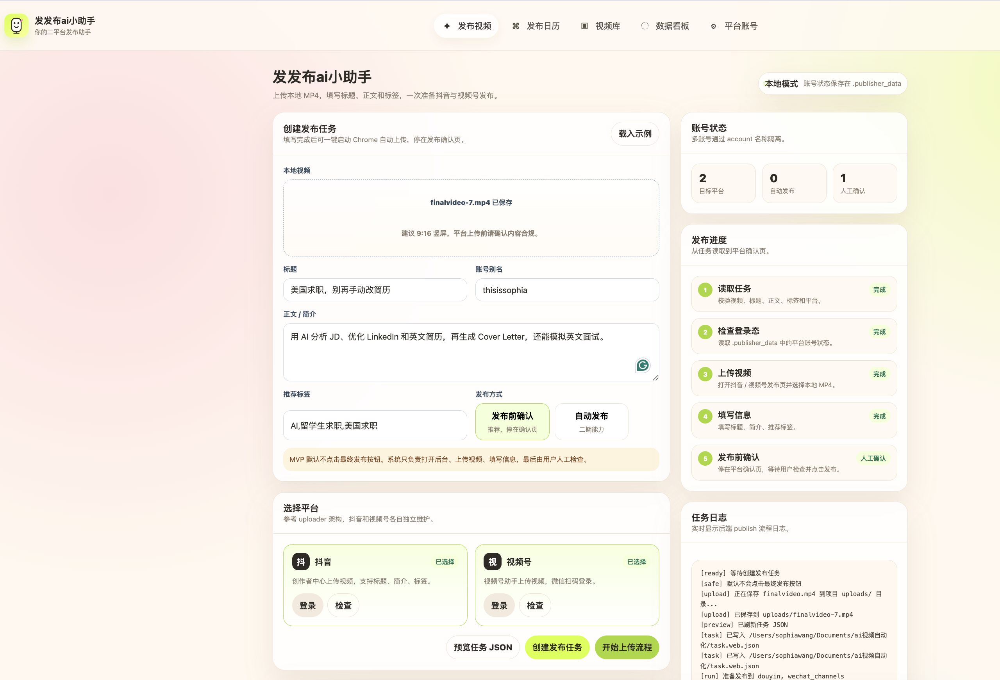
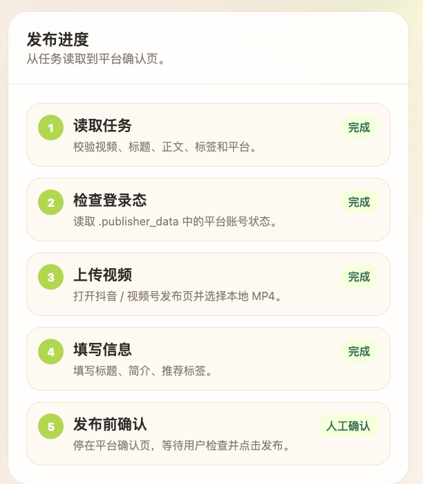

# 发发布ai小助手

发发布ai小助手是一个本地 AI 视频自动化项目，目标是把一条已经做好的短视频，从本地文件变成可以上传到抖音和视频号的发布任务。

它包含两部分：

```text
AI 视频制作
  ↓
finalvideo.mp4
  ↓
发发布ai小助手网页（选视频、填标题、正文、标签、平台）
  ↓
点击「开始上传流程」按钮
  ↓
本地后端自动启动浏览器自动化
  ↓
抖音 / 视频号上传页
  ↓
填写标题、正文、标签
  ↓
停在发布确认页
  ↓
用户人工检查并手动发布
```

当前版本默认不会点击最终发布按钮，需要用户自己在平台页面确认后手动发布。

## 网页界面



左侧填写视频、标题、正文、标签并选择平台；点「开始上传流程」一键触发浏览器自动上传，右侧实时显示 5 步发布进度和后端日志。




![发发布ai小助手发布任务日志task log](docs/task_log.png）

## 项目目标

这个项目解决的是：

- 用户已经有一个本地视频文件。
- 用户在网页里填写标题、正文、标签。
- 用户选择要发布的平台：抖音、视频号，或两个都选。
- 系统生成一个发布任务文件。
- 系统自动打开平台后台，上传视频并填写发布信息。
- 最后停在确认页，由用户人工检查并决定是否发布。

这个项目不做：

- 不保存账号密码。
- 不绕过扫码登录。
- 不绕过验证码。
- 不绕过平台风控。
- 不默认点击最终发布按钮。
- 不支持小红书、B站、快手等其他平台。

## 项目结构

```text
.
├── README.md
├── PRD_ai_video_publisher.md
├── web/
│   └── index.html
├── ai_video_publisher/
│   ├── __main__.py
│   ├── server.py
│   ├── publish_flow.py
│   ├── config.py
│   ├── task.py
│   ├── browser.py
│   └── uploaders/
│       ├── base.py
│       ├── douyin.py
│       └── wechat_channels.py
├── hyperframes/
│   ├── briefs/
│   ├── scripts/
│   ├── prompts/
│   ├── assets/
│   ├── renders/
│   ├── exports/
│   └── finalvideo.mp4
├── examples/
│   └── task.example.json
├── docs/
│   └── web-front-page.png
├── uploads/
└── task.web.json
```

## AI 视频制作流程

本项目里的示例视频主题是：

```text
海外留学生如何用 AI 提升求职效率
```

视频制作文件放在：

```text
hyperframes/
```

主要文件包括：

```text
hyperframes/briefs/01_design.md
hyperframes/scripts/02_script.md
hyperframes/scripts/03_storyboard.md
hyperframes/scripts/04_voiceover.md
hyperframes/scripts/05_production.md
hyperframes/scripts/06_validation.md
hyperframes/scripts/07_中文分镜方案.md
```

视频制作步骤：

```text
1. 确定主题和目标观众
2. 编写脚本和口播稿
3. 拆分每一个分镜
4. 设计字幕、配音、音乐和转场
5. 生成分镜画面
6. 生成封面图和片尾图
7. 导出最终视频 finalvideo.mp4
```

最终视频默认放在：

```text
hyperframes/finalvideo.mp4
```

## 发发布ai小助手能做什么

网页端可以做：

```text
1. 选择本地视频
2. 填写标题
3. 填写正文
4. 填写推荐标签
5. 选择发布平台
6. 生成发布任务 task.web.json
7. 点击「开始上传流程」一键触发浏览器自动上传
8. 实时查看发布进度（5 步进度条 + 后端日志）
```

后端命令可以做：

```text
1. 打开抖音创作者中心
2. 打开微信视频号助手
3. 保存并复用登录状态
4. 上传本地 MP4 视频
5. 填写标题、正文、标签
6. 停在平台发布确认页
```

## 安装依赖

进入项目目录：

```bash
cd /Users/sophiawang/Documents/ai视频自动化
```

安装依赖：

```bash
python3 -m pip install -r requirements.txt
```

说明：当前项目会优先使用电脑里已经安装好的 Google Chrome。如果浏览器可以正常弹出，就不需要额外下载 Chromium。

## 启动网页

在项目目录里运行：

```bash
python3 -m ai_video_publisher serve --port 8765
```

然后打开：

```text
http://127.0.0.1:8765
```

在网页里完成：

```text
1. 上传本地视频
2. 填写标题
3. 填写正文
4. 填写标签
5. 选择抖音 / 视频号
6. 点击创建发布任务
7. 点击「开始上传流程」（一键发布）
```

创建成功后，项目根目录会生成：

```text
task.web.json
```

点「开始上传流程」后不需要再去终端输命令：后端会自动启动浏览器，依次打开抖音和视频号的发布页，上传视频并填写信息，全程进度显示在网页右侧的「发布进度」和「任务日志」里。

流程停在发布确认页后：

```text
1. 到 Chrome 里逐个检查标题、正文、标签
2. 手动点击平台的发布按钮
3. 发布完成后直接关闭浏览器窗口，流程自动收尾
```

如果不手动关闭，浏览器保留 30 分钟后也会自动收尾。

示例：

```json
{
  "video": "uploads/finalvideo.mp4",
  "title": "美国求职，别再手动改简历",
  "description": "用 AI 分析 JD、优化 LinkedIn 和英文简历，再生成 Cover Letter，还能模拟英文面试。",
  "tags": [
    "AI",
    "留学生求职",
    "美国求职"
  ],
  "platforms": [
    "douyin",
    "wechat_channels"
  ],
  "publish_now": false
}
```

## 登录账号

第一次使用前，需要分别登录抖音和视频号。

登录抖音：

```bash
python3 -m ai_video_publisher login douyin --account creator
```

登录视频号：

```bash
python3 -m ai_video_publisher login tencent --account creator
```

浏览器打开后，在页面里扫码或手动登录。登录完成后，回到终端按回车，系统会保存登录状态。

登录状态会保存在：

```text
.publisher_data/
```

这个目录只保存在本地，不应该提交到代码仓库。

## 检查登录状态

检查抖音：

```bash
python3 -m ai_video_publisher check douyin --account creator
```

检查视频号：

```bash
python3 -m ai_video_publisher check tencent --account creator
```

如果浏览器能打开对应后台，并且不要求重新登录，说明登录状态可用。

## 执行发布任务

### 方式一：网页一键触发（推荐）

在网页里点「开始上传流程」按钮即可，见上文「启动网页」。后端自动执行 publish，网页上能看到实时日志和进度。

### 方式二：终端命令

确保 `task.web.json` 已经生成后，运行：

```bash
python3 -m ai_video_publisher publish task.web.json --account creator
```

如果任务里两个平台都选了，系统会依次处理：

```text
抖音上传 + 填写信息
  ↓
视频号上传 + 填写信息
  ↓
两个平台统一停在发布确认页
  ↓
回终端按一次 Enter 结束
```

两个平台互相独立：一个平台失败不影响另一个平台，结束时会在日志里输出汇总（例如 `[SUMMARY] douyin=ok,wechat_channels=fail`），有平台失败时命令退出码非零。

如果只想测试一个平台，可以把 `task.web.json` 里的 platforms 改成：

```json
["douyin"]
```

或者：

```json
["wechat_channels"]
```

## 单个平台上传命令

只测试抖音：

```bash
python3 -m ai_video_publisher upload-video douyin \
  --account creator \
  --file hyperframes/finalvideo.mp4 \
  --title "美国求职，别再手动改简历" \
  --desc "用 AI 优化 LinkedIn、分析 JD、生成 Cover Letter，还能模拟英文面试。" \
  --tags "AI,留学生求职,美国求职"
```

只测试视频号：

```bash
python3 -m ai_video_publisher upload-video tencent \
  --account creator \
  --file hyperframes/finalvideo.mp4 \
  --title "美国求职，别再手动改简历" \
  --desc "用 AI 帮助你的求职流程。" \
  --tags "AI,留学生求职,美国求职"
```

## 当前验收状态

已经完成：

```text
1. AI 视频脚本、分镜、配音、字幕方案
2. finalvideo.mp4 视频文件
3. 本地网页 UI
4. 网页上传视频到 uploads/
5. 网页生成 task.web.json
6. 抖音登录状态保存
7. 视频号登录状态保存
8. 抖音打开、上传视频、填写信息
9. 视频号打开、上传视频、填写信息
10. 默认停在发布确认页
11. 网页一键触发发布（后端自动执行，无需终端命令）
12. 网页实时显示发布进度和后端日志
13. 多平台故障隔离：一个平台失败不影响另一个，结束输出汇总
14. 发布结束自动收尾：关闭浏览器窗口即结束，30 分钟超时兜底
```

还可以继续优化：

```text
1. 网页里直接触发登录
2. 展示更细的上传进度
3. 保存每次发布日志
4. 增加失败重试提示
5. 用户确认后再支持自动点击最终发布
```

## 录屏演示顺序

录屏时可以按照这个顺序讲：

```text
1. 先展示 hyperframes 目录
   说明前面已经完成 AI 视频脚本、分镜、配音、字幕和成片。

2. 展示 finalvideo.mp4
   说明这是准备发布的短视频。

3. 启动本地网页
   运行 python3 -m ai_video_publisher serve --port 8765。

4. 打开 http://127.0.0.1:8765
   展示“发发布ai小助手”的网页界面。

5. 在网页里选择视频、填写标题、正文、标签
   选择抖音和视频号。

6. 点击「开始上传流程」按钮
   一键触发发布，无需终端命令；网页上实时显示 5 步进度和后端日志。

7. 展示浏览器自动打开平台后台
   视频自动上传，标题、正文、标签自动填写，两个平台依次处理。

8. 最后停在发布确认页
   说明为了安全，最终发布由用户人工确认；发布完成后关闭浏览器窗口，流程自动收尾。
```

## 一句话总结

发发布ai小助手把“AI 生成视频”和“本地自动上传发布”串成了一个最小闭环：用户准备好视频和文案后，系统自动上传到抖音和视频号，并在最终发布前交给用户确认。
